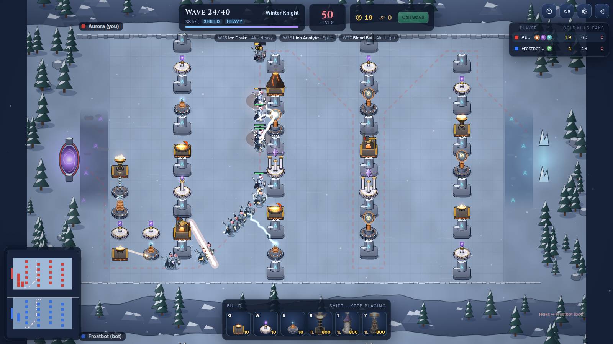
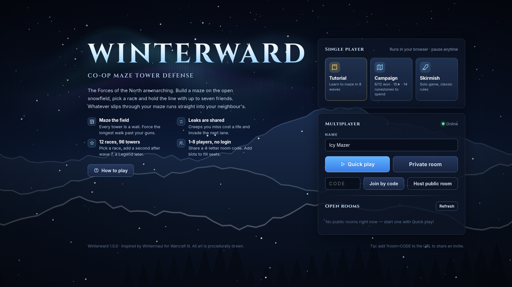
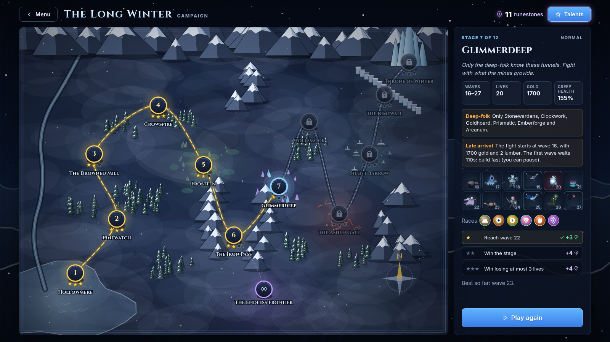
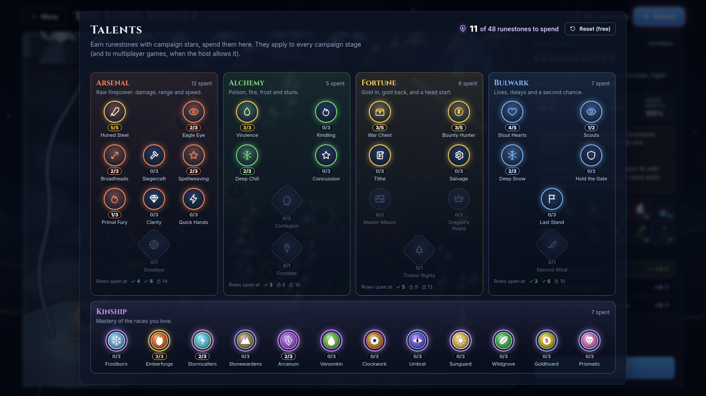
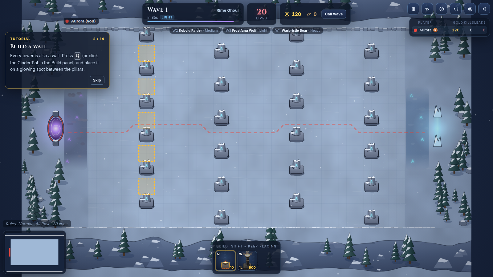
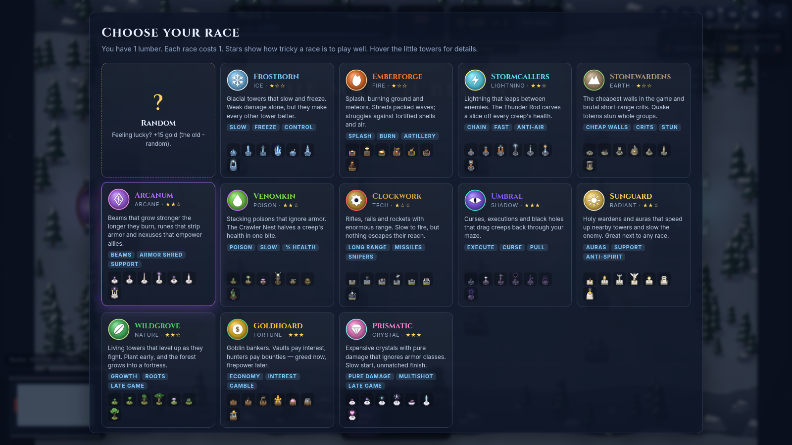

# ❄ Winterward

**A co-op maze tower defense for the browser, in the spirit of the Warcraft III map *Wintermaul*.**
Up to 8 players, no login, 12 races and 96 towers, 40 waves and a final boss. Build a maze on an open
snowfield: whatever slips through your maze runs straight into your neighbour's. Alone? Play the tutorial,
a 12-stage campaign with a talent tree, or a quick skirmish, all running right in your browser.

Version **1.0.0** · [Changelog](CHANGELOG.md)



## Play it locally

Requirements: **Node.js 20+** (22 recommended).

```bash
git clone https://github.com/StefanJonsson96/wintermaul.git
cd wintermaul
npm install
npm run play          # builds everything and starts the server
```

Open **http://localhost:8787**. For multiplayer press **Quick play** or create a private room, and add
bots if you like. Friends on the same network open `http://<your-ip>:8787` and join with your 4-letter
room code or the invite link from the lobby.

Development mode with hot reload (client on port 5173, proxied to the server on 8787):

```bash
npm run dev           # then open http://localhost:5173
```

## Game modes



| Mode | What it is |
|---|---|
| **Tutorial** | One click from the menu. An 8-wave game where a coach explains one idea at a time (walls, zig-zags, calling waves, upgrades, air, leaks, lumber) and waits for you to try it. |
| **Campaign** | *The Long Winter*: twelve stages on the road north, each with its own twist, three stars to earn and runestones for the talent tree. |
| **Skirmish** | A solo game with the classic rules. |
| **Multiplayer** | 1–8 players in a room, with bots to fill seats. The first player picks the rules, like Red in the original. |

Single-player games are simulated in your browser: press **P** to pause (they also pause when you switch
tabs) and **F** to play at 2× or 3× speed.

### The campaign



Every stage is a real game with its own rules. Some start at wave 1; others throw you into the war at
wave 15 or 30 with a war chest and a long first countdown to build in. Stages can limit the races you
may pick or add mutators: swift creeps, regeneration, extra armor, bigger waves. Each stage has three
stars:

1. **Reach** a given wave,
2. **Win** the stage,
3. win **losing at most a few lives**.

Stars pay **runestones**. Win a stage to open the next; win *The Iron Pass* to open **The Endless
Frontier**, which pays a runestone every 5 waves past wave 20 the first time you get there.



Spend runestones in the **talent tree**:

| Branch | Talents |
|---|---|
| **Arsenal** | Damage, range, attack speed, bonuses per damage type, and the *Deadeye* capstone (double-damage hits). |
| **Alchemy** | Stronger poison, burns, slows and stuns, poison that spreads, and *Frostbite* (slowed creeps take more damage). |
| **Fortune** | Starting gold, bounties, level bonus, better refunds, cheaper walls, interest, and *Timber Rights* (+1 lumber). |
| **Bulwark** | Lives, extra build time, slower creeps in your lane, softer boss leaks, *Last Stand*, and *Second Wind* (a second chance, once per game). |
| **Kinship** | Extra damage for each of the 12 races. |

Deeper rows open as you spend more in a branch. Respec is free. Progress is saved in your browser.
In multiplayer the host can switch **Campaign talents** on in the lobby (off by default), and everyone
brings the talents they earned.

## How to play



1. **Pick the rules.** When the game starts, the first player has 30 seconds to choose the difficulty,
   race mode and whether the game is endless.
2. **Pick a race** with your lumber (or go *Random* for bonus gold; `-random` works in chat too).
3. **Maze.** Creeps walk from the portal on the left to the gate on the right using the shortest path.
   Every tower is also a wall. Plug the gaps between the ancient pillars to bend the path cheaply, then
   build full walls to make a long serpentine. You can never fully block the path.
4. **Keep building** with every bounty during the first waves, then **upgrade in place** (two branches
   per tower, tier 1 → 4) and save for big towers.
5. **Leaks are shared.** A creep that reaches your gate costs the team lives and runs into the next
   player's lane with the health it has left. Kill your neighbour's leaks for their bounty, or help them
   with a gold gift (right-click them in the scoreboard).
6. You get more lumber after waves 7 and 20: a second race, a third, or a **Legend** tower. Survive 40
   waves. The last is led by the Winter Tyrant, and if he escapes the north falls.

| Control | Action |
|---|---|
| Left click | Select a tower / place a tower (hold **Shift** to keep placing) |
| Drag / double-click | Box-select / select all towers of that type on screen |
| Q W E R T Y | Build buttons, or upgrade branches when towers are selected |
| L | Choose a new race (when you have lumber) |
| X / Delete | Sell selected towers |
| Right click / Esc | Cancel placement / deselect |
| Wheel, arrows, right- or middle-drag | Zoom and move the camera |
| Space | Jump back to your lane |
| G | Ready / call the next wave early |
| P / F | Pause / game speed (single player) |
| Alt + click | Ping the map for your team |
| Enter | Chat (`-random`, `-ready`, `-help`) |



## What's inside

- **Research-based design.** The rules come from the original map's own script and data (lives, level
  bonus, lumber, leak flow, anti-block, the difficulty dialog…) plus Wintermaul One's lane rotation. See
  [docs/RESEARCH.md](docs/RESEARCH.md) and [docs/DESIGN.md](docs/DESIGN.md).
- **One simulation everywhere.** The same deterministic TypeScript simulation runs on the server
  (multiplayer), in the browser (single player), in the bots and in the headless balance scripts.
- **Authoritative multiplayer**: Node + WebSocket server simulating at 20 Hz, 10 Hz snapshots,
  client-side interpolation, reconnect-by-token, spectators, lobby with public and private rooms.
- **All art is procedural**: canvas drawing code for the towers (a building style per race), the 24
  creature shapes, the terrain, the emblems and the campaign map. All sound is synthesized with
  WebAudio. No third-party assets.

```
src/shared/          rules and data (races, towers, waves, campaign, talents), grid, protocol
src/shared/sim/      the simulation: game (state, commands, waves), horde (creeps), combat (towers),
                     talent bonuses, bots, and the real-time runner
src/server/          HTTP + WebSocket server, rooms and lobby
src/client/          menu and lobby, local single-player games, tutorial
src/client/game/     game view: renderer, HUD, dialogs, effects, input
src/client/campaign/ campaign map, briefings, talent tree, saves
src/client/art/      procedural towers (a kit per race), creatures, terrain
scripts/             balance runners, determinism fingerprint, browser tests, README screenshots
tests/               unit tests (vitest)
docs/                research notes, design, hosting guide
```

## Useful commands

| Command | What it does |
|---|---|
| `npm run play` | Build and start (production) on port 8787 |
| `npm run dev` | Server + Vite dev server with hot reload |
| `npm run check` | Typecheck and unit tests (what CI runs, plus the build) |
| `npm run balance -- --players 2 --games 6` | Headless bot games for balancing |
| `npm run balance:campaign` | Plays every campaign stage with bots holding typical talents |
| `npm run fingerprint` | Hashes seeded bot games: a refactor that changes nothing leaves it identical |
| `WINTERWARD_DEV=1 npm start` | Testing chat commands: `-gold 5000`, `-wave 20`, `-speed 4`, `-lumber 1`, `-autopilot` |
| `node scripts/readme-shots.mjs` | Regenerates the images in `docs/images` (needs a dev server) |

## Hosting

See **[docs/HOSTING.md](docs/HOSTING.md)** for free options (LAN, Cloudflare Tunnel, Render, Koyeb, Oracle
Cloud free VM) and a Dockerfile.

## Credits

Inspired by *Wintermaul* by dukewintermaul and the many Wintermaul versions that followed (Wintermaul One,
Revamped, Revolution). Winterward is an independent fan project with original names, art and code; it
contains no Warcraft III assets.
